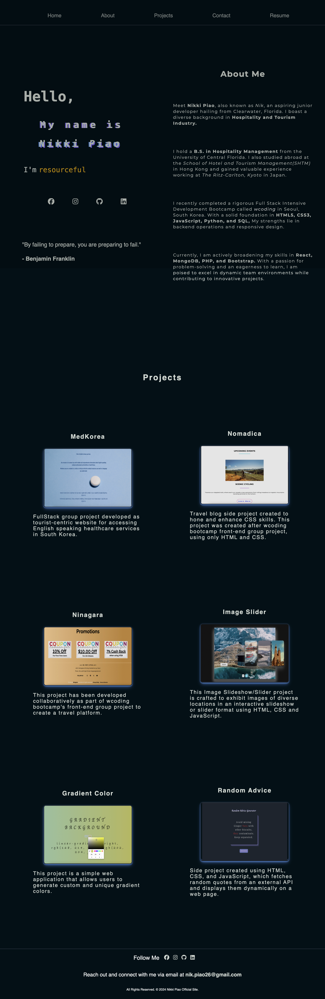

# web-portfolio

Portfolio Project

Introduction

Welcome to my Portfolio! Crafted with only HTML, CSS, and JavaScript, this project is a static website that highlights my skills, experiences, and projects. Explore sections dedicated to learning about me, discovering my skills, exploring my projects, and finding contact information. No backend or frontend frameworks were used, ensuring a pure representation of my capabilities.

Features

Responsive Design: The portfolio is designed to be fully responsive, ensuring a seamless experience across various devices and screen sizes.

Dynamic Content: Content such as projects and skills are dynamically generated to allow for easy updates and additions.

HTML, CSS, JavaScript: Utilizes the fundamentals of web development including HTML for structure, CSS for styling, and JavaScript for interactivity.

#Content Attribution:

This repository contains a curated collection of public domain quotes sourced from TheGoldenQuotes.net.

These quotes are provided freely and can be used without any restrictions.

"I would like to extend my thanks to TheGoldenQuotes.net for their dedication in curating and sharing these public domain quotes."

Source: [TheGoldenQuotes.net](https://www.thegoldenquotes.net/)

Notes:

The "Exports" folder houses both a Python file named "quotes.py" and a JSON file named "quotes.json." Quotes are manually inputted within the Python file and subsequently converted into JSON format.

To run this project locally:

Clone this repository to your local machine.

Navigate to the project directory.

Open the index.html file in your web browser.

Contribution

Contributions are welcome! If you find any issues or have suggestions for improvement, feel free to open an issue or submit a pull request.

Contact

For any inquiries or collaboration opportunities, you can reach me at nik.piao26@gmail.com
